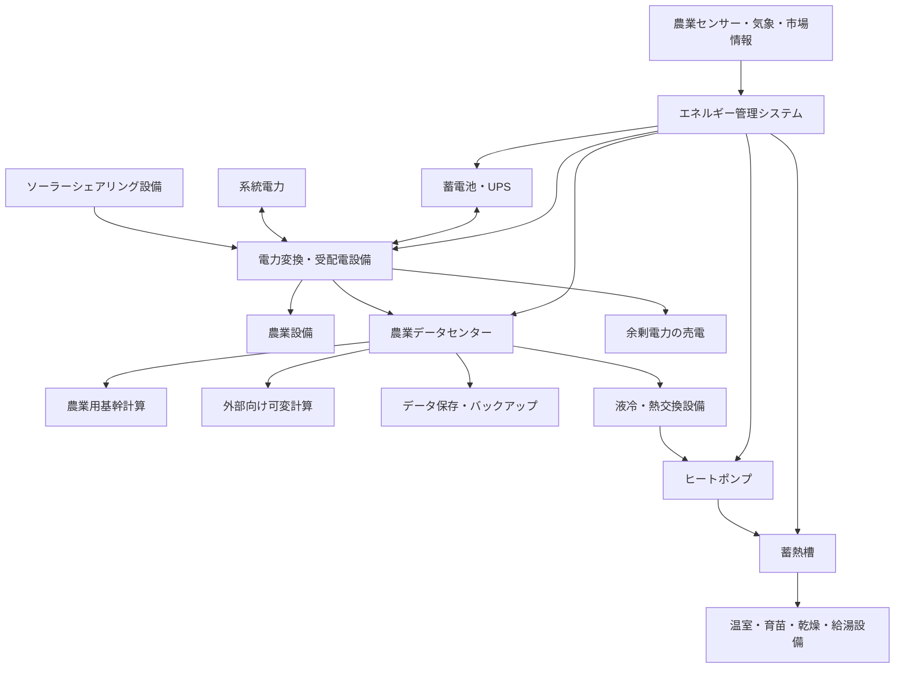

# ソーラーシェアリング × 農業データセンター構想  
## 技術成立性・事業性・概算予算に関する初期調査報告書

- **調査基準日**：2026年7月29日
- **調査段階**：構想・初期フィージビリティ調査
- **想定地域**：日本国内
- **金額表記**：原則として税別概算

---

## 1. エグゼクティブサマリー

本構想は、ソーラーシェアリングによって農地上部で太陽光発電を行い、その電力でサーバを運用するとともに、サーバの計算資源をスマート農業および外部向けサービスに利用し、さらにサーバ排熱を冬季の栽培施設暖房へ再利用するものである。

構想を構成する主要要素は、次の4つである。

1. 農産物の生産
2. 太陽光発電
3. 計算資源の提供
4. サーバ排熱の農業利用

単なる営農型太陽光発電ではなく、電力を計算サービスへ変換し、その副産物である熱を農業へ戻す点に特徴がある。

技術的には実現可能であり、環境省も2026年度に、再生可能エネルギーを活用するデータセンターや、データセンター排熱を地域で利用する設備などを対象とした支援事業を実施している。したがって、構想の方向性は現在の脱炭素・地域分散型データセンター政策とも整合する。

ただし、成功には次の前提がある。

- 完全オフグリッドを目指さない
- 系統電力と接続する
- 太陽光発電量に応じて計算負荷を調整する
- 24時間稼働が必要な計算と、停止可能な計算を分離する
- 空冷排気ではなく、液体を介してサーバ排熱を回収する
- 蓄電池と蓄熱槽を役割分担させる
- 発電事業や計算事業よりも営農の継続を優先する

本調査で想定する**10kW級の統合実証設備**の概算設備費は、次のとおりである。

> **約9,600万円〜2億2,100万円**

税、運転開始後の資金、追加工事、資材価格変動などを含む推奨資金調達額は、次の範囲となる。

> **約1.3億円〜2.5億円**

---

## 2. 構想の定義

本構想は、次のように定義できる。

> **農業を主目的とし、再生可能エネルギーに追従する計算負荷と、サーバ排熱の農業利用を組み合わせた地域分散型エッジデータセンター**

「太陽光でサーバを動かす設備」だけではなく、以下を統合制御するシステムとして設計する必要がある。

- 農業生産
- 太陽光発電
- 系統電力
- 蓄電池
- サーバ負荷
- サーバ冷却
- 排熱回収
- 蓄熱
- 栽培施設の暖房
- 外部計算ジョブ
- 農業用計算ジョブ

この統合制御システム自体が、構想における重要な技術的・事業的資産となる。

---

## 3. システム全体構成



---

## 4. 技術的成立性

### 4.1 太陽光発電とサーバ負荷

太陽光発電は昼間、晴天時、春から夏に発電量が多くなる。一方、サーバは一般に24時間稼働し、栽培施設の暖房需要は冬季の夜間や早朝に大きくなる。

そのため、以下の3つの時間的なずれが発生する。

- 太陽光発電量の変動
- 計算需要の変動
- 暖房需要の変動

このずれを、蓄電池だけで解決しようとすると設備費が大きくなる。

推奨構成は、次のとおりである。

- 系統連系
- 小中容量の蓄電池
- UPS
- 大容量の温水蓄熱槽
- 発電量に追従する計算ジョブ
- 冬季の熱需要に追従する計算ジョブ

---

### 4.2 50kW太陽光と10kWサーバのエネルギーバランス

本調査の実証モデルでは、以下を想定する。

| 項目 | 想定値 |
|---|---:|
| 太陽光発電設備 | 50kW |
| サーバIT負荷 | 最大10kW |
| 目標PUE | 1.2〜1.4 |
| 施設全体負荷 | 約12〜14kW |
| 蓄電池 | 50kWh |
| 運転方式 | 系統連系 |
| 稼働形態 | 基幹負荷＋可変負荷 |

一般的な太陽光発電では、設備容量1kW当たり年間約1,000kWhの発電量が一つの目安とされる。地域、気候、設置角度、方位などにより1〜3割程度変動する。

したがって、50kWの太陽光発電設備による年間発電量の概算は、次のようになる。

```text
50kW × 約1,000kWh/kW・年
＝ 約50,000kWh/年
＝ 約50MWh/年
```

10kWのIT機器を24時間連続稼働させた場合の年間消費電力量は、次のとおりである。

```text
10kW × 24時間 × 365日
＝ 87,600kWh/年
＝ 87.6MWh/年
```

冷却、UPS、ポンプ、通信、照明などを含め、PUEを1.2〜1.4と仮定すると、施設全体では年間約105〜123MWhを消費する。

このため、50kWの太陽光設備では、10kWサーバを24時間運転する年間電力量のすべてを賄うことはできない。

50kW太陽光は、以下を目的とする規模である。

- 統合制御の実証
- 昼間のサーバ電力の自家消費
- 可変計算ジョブの運転
- 電力ピークの抑制
- 排熱回収の検証
- 農業と発電の両立検証

年間の電力量だけを同等にする場合でも、概ね120〜150kW程度の太陽光設備が必要となる。ただし、この容量を設置しても、夜間や長期悪天候時の運転には系統電力または大容量蓄電池が必要である。

---

### 4.3 サーバ負荷の二層化

サーバ負荷は、停止できない処理と停止可能な処理に分ける必要がある。

#### 第1層：農業用基幹計算

停止させにくい処理である。

- 栽培環境制御
- 灌水制御
- センサーデータ収集
- 監視カメラ
- 病害虫検知
- 農場内ネットワーク
- データベース
- ローカルAI推論
- 災害時の地域情報処理

この層には、以下が必要となる。

- UPS
- 系統電力
- 冗長ストレージ
- 安全停止機能
- 遠隔監視
- バックアップ

#### 第2層：可変計算

太陽光発電量や熱需要に合わせて、起動・停止・性能調整が可能な処理である。

- AIモデルの学習・追加学習
- 農業画像の一括解析
- ドローン画像処理
- 動画変換
- 科学技術計算
- レンダリング
- 大量データの前処理
- バックアップ複製
- 再実行可能なバッチ処理

外部への貸出しは、24時間無停止の一般的なVPSよりも、次のような形態が適している。

- スポット計算
- バッチ計算
- 発電連動型計算
- 実行期限に余裕のあるジョブ
- 再実行可能なジョブ
- 地域・大学・研究機関向け共同計算基盤

---

## 5. サーバ排熱の利用

### 5.1 回収可能な熱量

サーバが消費した電力のほぼすべては、最終的に熱となる。

10kWのIT負荷を年間連続稼働させた場合、理論上の発熱量は年間87.6MWhである。

回収率を70〜80％と仮定すると、回収可能熱量の概算は次の範囲となる。

```text
87.6MWh × 70〜80％
＝ 約61〜70MWh/年
```

ただし、すべてを農業で使用できるわけではない。

実際の有効利用量は、以下に左右される。

- 冬季暖房需要
- 温室の断熱性能
- サーバ稼働率
- 回収水温
- ヒートポンプ効率
- 蓄熱容量
- サーバと栽培施設の距離
- 配管からの熱損失

---

### 5.2 推奨する熱回収方式

サーバ室の温風を、そのまま温室へ送る方式は推奨しない。

直接送風方式には、次の問題がある。

- 温室の湿気がサーバ設備へ侵入する
- 埃、虫、農薬、肥料成分が入り込む
- 結露が発生する
- サーバ室と栽培施設の衛生管理を分離できない
- 必要な温度まで昇温しにくい
- 夏季に熱を処理できない

推奨方式は、サーバ設備と農業施設を空気的に分離し、閉鎖式の水系統で熱だけを移送する方式である。

候補となる冷却方式は以下である。

- ダイレクト・トゥ・チップ液冷
- リアドア熱交換器
- 温水冷却対応サーバ
- 液浸冷却
- CDUを使用した二次冷却水系統

熱回収系統は、概ね次の構成となる。

```text
サーバ
  ↓
液冷設備
  ↓
CDU・熱交換器
  ↓
ヒートポンプ
  ↓
温水蓄熱槽
  ↓
温室・育苗・乾燥・給湯設備
```

---

### 5.3 夏季の排熱利用先

温室暖房だけでは、夏季に熱が余る。

年間の熱利用率を高めるためには、以下も検討する。

- 農産物乾燥
- 木材・竹材乾燥
- 育苗
- 土壌加温
- 給湯
- 発酵施設
- キノコ栽培
- 養殖
- 吸収式冷凍機
- 周辺福祉施設や公共施設への熱供給

---

## 6. 蓄電池と蓄熱槽の役割

蓄電池と蓄熱槽は、別の目的で使用する。

### 蓄電池

- 瞬時停電への対応
- 太陽光出力の短時間変動への対応
- サーバの安全停止
- ピークカット
- UPSから非常用電源への移行
- 短時間の自立運転

### 蓄熱槽

- 昼間に発生した熱の夜間利用
- 暖房需要のピーク対応
- ヒートポンプ運転の平準化
- サーバ負荷と暖房需要の時間差吸収

業務・産業用蓄電システムについて、2024年度の補助事業における平均コストは約9.2万円/kWhと報告されている。2030年度の業務・産業用蓄電システムの目標価格は、工事費込みで6万円/kWhとされている。

50kWhの蓄電池について、単純計算では約460万円となるが、実際には以下が追加される。

- PCS
- 制御盤
- 保護装置
- 消防設備
- 基礎工事
- 配線
- EMS連携
- 輸送・据付
- 設計費

そのため、本調査では50kWhの蓄電池設備一式を、約460万〜750万円としている。

---

## 7. 営農型太陽光発電に関する留意点

日本の営農型太陽光発電では、農地に支柱を設置して上部空間に発電設備を設ける場合、支柱部分について農地転用許可が必要となる。

2024年4月1日から、営農の継続を確保するための許可基準やガイドラインが農地法施行規則等に位置付けられている。発電を優先して下部農地での営農がおろそかになる事例を排除することが制度上明確化された。

一時転用許可を受けた事業者には、原則として毎年度、栽培実績および収支の報告が求められる。

したがって、本構想では以下を基本方針とする必要がある。

- 農業を事業の主目的とする
- 作物に合わせて遮光率を決定する
- 農機が通行できる架台高・支柱間隔を確保する
- 栽培実績、収量、品質、収支を継続的に記録する
- 発電設備が営農を妨げないことを示す
- サーバ設備の設置によって農地利用を阻害しない

サーバコンテナ、受変電設備、蓄電池、燃料設備、事務所などは、営農型太陽光発電の支柱部分とは異なる土地利用になる可能性が高い。

実務上は次の配置が望ましい。

- ソーラーシェアリング設備：農地上
- サーバ設備：隣接する非農地
- 受変電・蓄電池設備：非農地または別途許可を得た区画
- 熱利用設備：栽培施設付近
- 熱配管：サーバ設備から栽培施設へ敷設

計画初期から、以下への事前相談が必要である。

- 農業委員会
- 市町村の農政担当部署
- 都道府県
- 建築担当部署
- 消防
- 電力会社
- 通信事業者
- 保険会社

---

## 8. 事業収益の構成

本構想では、複数の収益・コスト削減効果を組み合わせる。

### 8.1 農産物収入

本来の農業収益である。

- 農産物販売
- 苗・種苗販売
- 加工品販売
- 体験・教育事業
- 試験栽培受託

### 8.2 電力価値

- 太陽光電力の自家消費
- サーバ電力費削減
- 農業設備の電力費削減
- ピーク電力削減
- 余剰電力の売電
- 非常時電源

2025年に設置された一般的な10kW以上の事業用地上設置太陽光発電設備のシステム費用は、平均20.3万円/kW、中央値19.7万円/kWと報告されている。

営農型太陽光発電では、高い架台、農機通路、基礎、耐風・積雪設計、施工条件などにより、一般的な地上設置型より高くなる可能性がある。

本調査では、初期計画用の単価として以下を設定する。

> **25万〜40万円/kW**

50kWの場合は、約1,250万〜2,000万円となる。

これは確定見積りではなく、営農型設備の追加コストを考慮した計画上の仮定である。

### 8.3 計算サービス収入

- 農業画像解析
- AI推論
- AIモデル学習
- バッチ処理
- レンダリング
- データ変換
- バックアップ
- 分散ストレージ
- 大学・研究機関向け計算
- 地域企業向けプライベートクラウド

### 8.4 排熱利用によるコスト削減

- 灯油削減
- 重油削減
- LPG削減
- 電気暖房削減
- 給湯費削減
- 農産物乾燥費削減

### 8.5 地域サービス

- 災害時の電力・通信拠点
- 地域農家向け共同計算基盤
- 農業データ保管
- 地域向けAI
- スマート農業機器管理
- 研究・教育実証フィールド

---

## 9. 収益性の基本式

太陽光電力をサーバへ使用する場合、売電した場合との比較が必要になる。

```text
計算資源利用の実質価値
＝ 計算サービス収入
－ サーバ償却費
－ 冷却・通信・保守費
－ 系統電力購入費
＋ 排熱による暖房費削減
＋ 農業生産性向上効果
－ 売電しなかったことによる機会損失
```

事業性を判断する主要指標は、サーバ稼働率だけではない。

- 計算資源販売単価
- サーバ稼働率
- 太陽光自家消費率
- 排熱回収率
- 排熱有効利用率
- 系統電力使用率
- 暖房燃料削減額
- 作物収量への影響
- サーバ設備の更新周期
- 保守・人件費

---

## 10. 想定する初号実証設備

本調査で推奨する実証設備は、以下のとおりである。

| 分類 | 想定 |
|---|---|
| サーバIT負荷 | 最大10kW |
| ラック | 2〜3ラック |
| 太陽光発電 | 50kW |
| 蓄電池 | 50kWh |
| 電力 | 系統連系 |
| 冷却 | 液冷または水冷熱交換 |
| 熱利用 | ヒートポンプ＋蓄熱槽 |
| 農業施設 | 既存ハウス等を利用 |
| 計算機 | CPU・ストレージ中心、一部GPU |
| 外部サービス | バッチ・スポット計算 |
| 実証期間 | 少なくとも冬季を含む1年間 |

---

## 11. 初号実証設備の概算予算

### 11.1 設備費

| 項目 | 想定内容 | 概算 |
|---|---|---:|
| 事前調査・基本設計・許認可 | 日射、営農、熱需要、系統、通信、建築、消防等 | 800万〜2,000万円 |
| 営農型太陽光発電 | 50kW、架台、パネル、PCS、施工 | 1,250万〜2,000万円 |
| 受変電・系統連系・EMS | 分電盤、変圧器、保護装置、計測・制御 | 500万〜1,200万円 |
| 蓄電池 | 50kWh、PCS、基礎、保護・制御設備 | 460万〜750万円 |
| データセンター設備 | コンテナ・専用室、UPS、ラック、冷却、消防 | 2,500万〜5,000万円 |
| サーバ・ネットワーク | CPU、ストレージ、GPU、スイッチ、予備機 | 1,500万〜5,000万円 |
| 排熱回収設備 | 液冷、CDU、熱交換器、ヒートポンプ、蓄熱槽、配管 | 1,000万〜2,500万円 |
| 農業IoT・監視設備 | センサー、カメラ、通信、制御、セキュリティ | 300万〜800万円 |
| 予備費 | 上記合計の約15％ | 約1,200万〜2,900万円 |
| **合計** |  | **約9,600万〜2億2,100万円** |

---

### 11.2 予算に含まないもの

上記には、原則として次を含まない。

- 土地購入費
- 大規模な造成費
- 新規の農業法人設立費
- 新設温室の建設費
- 農業機械
- 選果・加工・冷蔵設備
- 高圧受電線の長距離引込
- 通信回線の大規模敷設
- 非常用発電機
- 24時間有人監視
- 最新GPUの大規模導入
- 消費税
- 借入金利
- サーバ更新積立金

既存の温室を利用できない場合は、栽培施設の建設費を別途計上する必要がある。

---

### 11.3 推奨資金調達額

設備費だけでなく、次の資金を確保する必要がある。

- 消費税
- 初年度人件費
- 電力費
- 通信費
- 保険
- 保守契約
- 追加設計
- 工事遅延
- 設備不具合への対応
- 顧客獲得までの運転資金

したがって、初号実証設備に対する推奨資金調達額は、次の範囲となる。

> **約1.3億円〜2.5億円**

---

## 12. 年間運営費の概算

| 項目 | 年間概算 |
|---|---:|
| 技術・運営人件費 | 800万〜1,800万円 |
| サーバ・電気設備保守 | 200万〜500万円 |
| 通信回線 | 60万〜240万円 |
| 系統電力 | 100万〜400万円 |
| 保険・警備・監視 | 100万〜300万円 |
| ソフトウェア・セキュリティ | 50万〜200万円 |
| その他消耗品・予備部品 | 50万〜200万円 |
| **合計** | **約1,300万〜3,200万円/年** |

以下は別途考慮する。

- 減価償却
- 借入金利
- 土地賃借料
- 農業部門の人件費
- 農業資材費
- サーバ更新費
- GPU更新費
- 法人管理費
- 営業費

所有者自身が運営・保守を行う場合は、人件費を抑えられる。一方、外部顧客へ計算サービスを提供する場合は、技術者、セキュリティ、顧客対応、障害対応のコストが増える。

---

## 13. 規模別の予算目安

### 13.1 最小技術検証

| 項目 | 内容 |
|---|---|
| IT負荷 | 3〜5kW |
| 太陽光 | 20〜30kW |
| サーバ | 1ラック未満 |
| 蓄電池 | なし、または小容量 |
| 熱利用 | 小規模な温水回収 |
| 外部貸出し | 原則として行わない |
| 概算予算 | **5,000万〜8,000万円** |

既存建物、既存太陽光、既存ハウス、中古サーバなどを活用する前提である。

---

### 13.2 推奨初号実証

| 項目 | 内容 |
|---|---|
| IT負荷 | 最大10kW |
| 太陽光 | 50kW |
| 蓄電池 | 50kWh |
| ラック | 2〜3ラック |
| 熱利用 | 液冷＋ヒートポンプ＋蓄熱 |
| 外部貸出し | バッチ・スポット計算 |
| 設備費 | **約1億〜2.2億円** |
| 推奨資金調達額 | **約1.3億〜2.5億円** |

---

### 13.3 地域向け小規模商用設備

| 項目 | 内容 |
|---|---|
| IT負荷 | 50〜100kW |
| 太陽光 | 300〜500kW程度 |
| 蓄電池 | 300〜1,000kWh |
| 外部貸出し | 商用計算サービス |
| CPU・ストレージ中心 | **約5億〜10億円** |
| GPU中心 | **約10億〜20億円以上** |

この規模では、以下が必要になる。

- 高圧または特別高圧受電の検討
- 冗長冷却
- 複数通信回線
- 本格的な消防設備
- サイバーセキュリティ体制
- 24時間監視
- 顧客向けSLA
- 予備サーバ
- 保守要員
- 大規模な熱需要先

上記はオーダーを把握するための初期概算であり、商用化には基本設計、電力会社との協議、サーバ構成、GPU機種、冗長化水準に基づく個別見積りが必要である。

---

## 14. 補助金の可能性

2026年度には、環境省による「データセンターのゼロエミッション化・地域共生加速化事業」が実施されている。再生可能エネルギーの導入、脱炭素化、省エネルギー、地域共生などを目的としたデータセンター設備が対象となる。

環境省の2026年度事業概要では、データセンター脱炭素化支援事業について補助率1/3が示されている。

また、地域共生型データセンター支援では、以下の設備が対象例として示されている。

- 未利用再生可能エネルギー利用設備
- 蓄エネルギー設備
- 温度差エネルギー利用設備
- 未利用熱利用設備
- データセンター排熱の供給設備
- 省CO2性能の高い冷却設備

別途、環境配慮技術の開発・実証事業では、補助率1/2、最大2.5億円などの制度も存在する。

ただし、次の点に注意する。

- サーバ本体がすべて補助対象になるとは限らない
- 太陽光、蓄電池、冷却、熱回収で対象制度が異なる
- 同一設備に複数補助金を重複適用できない場合がある
- CO2削減量や再エネ比率の要件がある
- 交付決定前の発注・契約が認められない場合がある
- 年度ごとに公募条件が変わる
- 採択を保証するものではない

そのため、資金計画では補助金を前提収入にせず、採択された場合の上振れ要素として扱うべきである。

---

## 15. 主なリスク

### 15.1 営農継続リスク

発電やデータセンター事業を優先し、下部農地の営農が不十分になると、農地転用許可の継続に影響する可能性がある。

対策：

- 栽培責任者を明確にする
- 作物別の遮光試験を行う
- 収量・品質・収支を記録する
- 農業部門と発電部門の会計を分ける
- 発電設備導入前の営農計画を精査する

---

### 15.2 電力不足リスク

50kW太陽光では、10kWサーバの24時間運転をすべて賄えない。

対策：

- 系統連系
- サーバ負荷制御
- 基幹負荷と可変負荷の分離
- 電力単価に応じたスケジューリング
- 重要処理の優先制御

---

### 15.3 計算需要不足リスク

サーバを設置しても、外部顧客が確保できなければ収益化できない。

対策：

- 設備購入前に顧客候補を確保する
- 大学・研究機関と連携する
- 地域企業のバックアップ需要を調査する
- 農業画像解析など用途を限定して開始する
- 一般クラウドとの価格競争を避ける
- 再エネ連動・地域分散・排熱利用という付加価値を明確化する

---

### 15.4 排熱需要不足リスク

サーバは通年発熱するが、暖房需要は冬季に偏る。

対策：

- 蓄熱槽
- 農産物乾燥
- 育苗
- 給湯
- 養殖
- 周辺施設への熱供給
- 夏季のサーバ負荷抑制

---

### 15.5 冷却・結露リスク

農業施設は高湿度で、埃、虫、薬剤成分も存在する。

対策：

- サーバ設備と農業施設の完全分離
- 閉鎖式水系統
- 液冷
- 漏水検知
- 結露監視
- 防虫・防塵
- 独立換気

---

### 15.6 通信リスク

農村部では、高速回線や冗長回線を確保できない場合がある。

対策：

- 計画初期に光回線を確認する
- 異なる通信事業者の二重化
- モバイル回線・衛星回線のバックアップ
- オフラインでも農業制御を継続できる設計
- 外部通信停止時のジョブ保留

---

### 15.7 サイバーセキュリティリスク

外部向け計算サービスと農業制御設備を同一ネットワークに置くと、農業設備まで侵害される可能性がある。

対策：

- 農業制御ネットワークの分離
- 外部計算基盤の分離
- 管理ネットワークの分離
- ゼロトラスト
- 多要素認証
- ログ保管
- 脆弱性管理
- オフラインバックアップ

---

## 16. 推奨する実証ロードマップ

### フェーズ0：事業可能性調査

**予算：800万〜2,000万円**

調査内容：

- 候補農地
- 日射量
- 積雪・風速
- 地盤
- 作物と遮光率
- 年間暖房需要
- 系統接続
- 通信回線
- サーバ需要
- 排熱需要
- 農地・建築・消防制度
- 補助金適合性
- 事業収支

この段階で、以下を確定する。

- 作物
- 太陽光容量
- サーバ容量
- 排熱利用先
- 系統契約
- 顧客候補
- 運営主体
- 土地配置

---

### フェーズ1：小規模技術検証

**予算：5,000万〜8,000万円**

- IT負荷3〜5kW
- 太陽光20〜30kW
- 小型液冷設備
- 小型蓄熱槽
- 既存温室
- 発電追従型ジョブ
- 排熱回収量の測定

目的は収益化ではなく、技術成立性の確認である。

---

### フェーズ2：10kW統合実証

**設備費：約1億〜2.2億円**

- IT負荷最大10kW
- 太陽光50kW
- 蓄電池50kWh
- 液冷
- ヒートポンプ
- 蓄熱槽
- 農業IoT
- 外部向けスポット計算
- 少なくとも冬季を含む1年間の運用

この段階で、農業、発電、計算、排熱を統合して検証する。

---

### フェーズ3：50〜100kW商用化

実証結果が以下を満たした場合に拡張する。

- 計算顧客が確保されている
- 排熱利用先が確保されている
- 農業収量への悪影響が許容範囲内
- サーバ稼働率が事業計画を満たす
- 自家消費率が十分に高い
- 保守体制が確立している
- 系統・通信容量が確保されている

---

## 17. 実証で測定すべきKPI

### 農業

- 作物収量
- 品質
- 規格外率
- 日射量
- 気温
- 湿度
- 地温
- 土壌水分
- 水使用量
- パネルなし区画との差
- 農作業時間
- 暖房燃料使用量

### 発電・電力

- 時間別発電量
- 自家消費率
- 売電量
- 系統購入量
- 蓄電池充放電量
- ピーク電力
- 停電回数
- 電力単価
- 再エネ利用率

### データセンター

- IT消費電力
- 施設全体消費電力
- PUE
- CPU・GPU稼働率
- 外部ジョブ稼働率
- 障害件数
- 稼働率
- 通信量
- 顧客単価
- 計算1件当たり電力

### 熱利用

- サーバ発熱量
- 回収熱量
- 回収率
- 送水温度
- 戻り水温度
- ヒートポンプCOP
- 蓄熱量
- 配管損失
- 温室への供給熱量
- 排熱有効利用率
- 暖房費削減額

---

## 18. 重要な事業判断

この構想では、次の順序を守る必要がある。

1. 農業を成立させる
2. 発電設備を農業に適合させる
3. 電力を自家消費する
4. 発電量に合わせて計算する
5. 計算で発生した熱を回収する
6. 熱を農業へ戻す
7. 実績を基に外部向け計算サービスを拡張する

最初からすべてを最大化しようとすると、設備が過大になり、事業リスクが高くなる。

特に避けるべきなのは、次の構成である。

- 完全オフグリッド
- 大容量蓄電池への過度な依存
- 顧客未確保のGPU大量購入
- 空冷排気の直接温室供給
- 農地上への無計画なサーバ建屋設置
- 通常クラウドと同じ24時間SLA
- 夏季排熱利用先の未検討
- 補助金採択を前提とした資金計画

---

## 19. 最終評価

本構想は、技術的には実現可能であり、次の点で高い可能性を持つ。

- 農地の多面的利用
- 再生可能エネルギーの自家消費
- 地域分散型計算基盤
- スマート農業の高度化
- データセンター排熱の有効利用
- 化石燃料暖房の削減
- 地域レジリエンスの向上
- 農業・エネルギー・情報技術の統合

一方、単純な設備の組み合わせだけでは事業として成立しない。

本構想の中核的な価値は、以下にある。

> **農業・発電・計算・熱需要を一つのシステムとして最適化する統合運用技術**

最初の実証設備としては、以下の構成が妥当である。

- IT負荷最大10kW
- 太陽光50kW
- 蓄電池50kWh
- 系統連系
- 液冷・熱交換
- ヒートポンプ
- 温水蓄熱
- 既存栽培施設
- CPU・ストレージ中心
- 少数のGPU
- 発電追従型バッチ計算

必要設備費は、概ね次の範囲である。

> **約9,600万円〜2億2,100万円**

運転資金、税、追加工事への備えを含む推奨調達額は、次の範囲である。

> **約1.3億円〜2.5億円**

事業化にあたっては、まず800万〜2,000万円程度のフィージビリティ調査を行い、農業、電力、熱需要、通信、計算需要、制度、資金調達の条件を確定した上で、10kW級統合実証へ進むことが最も現実的である。

---

## 20. 参考資料

1. 農林水産省「再生可能エネルギー発電設備を設置するための農地転用許可」
2. 農林水産省「営農型太陽光発電に係る農地転用許可制度上の取扱い」
3. 経済産業省・調達価格等算定委員会「太陽光発電について」
4. 経済産業省「2024年度 定置用蓄電システム普及拡大検討会の結果」
5. 環境省「データセンターのゼロエミッション化・地域共生加速化事業」
6. 環境省「地域共生を目指したデータセンター脱炭素化設備導入支援事業」
7. IEA「Opportunities for district heating in the changing energy landscape」
8. 太陽光発電協会「太陽光発電により家庭で使用する電気を全部まかなえますか」
9. NEDO「太陽光発電システムの年間発電量に関する資料」